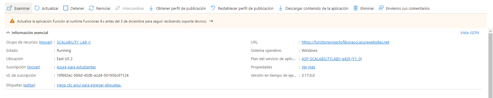

### Escuela Colombiana de Ingeniería
### Arquitecturas de Software - ARSW

## Escalamiento en Azure con Maquinas Virtuales, Sacale Sets y Service Plans

### Integrantes:

* Cristian Camilo Ruiz
* Deivid Sebastian Medina

### Dependencias
* Cree una cuenta gratuita dentro de Azure. Para hacerlo puede guiarse de esta [documentación](https://azure.microsoft.com/es-es/free/students/). Al hacerlo usted contará con $100 USD para gastar durante 12 meses.
Antes de iniciar con el laboratorio, revise la siguiente documentación sobre las [Azure Functions](https://www.c-sharpcorner.com/article/an-overview-of-azure-functions/)

### Parte 0 - Entendiendo el escenario de calidad

Adjunto a este laboratorio usted podrá encontrar una aplicación totalmente desarrollada que tiene como objetivo calcular el enésimo valor de la secuencia de Fibonnaci.

**Escalabilidad**
Cuando un conjunto de usuarios consulta un enésimo número (superior a 1000000) de la secuencia de Fibonacci de forma concurrente y el sistema se encuentra bajo condiciones normales de operación, todas las peticiones deben ser respondidas y el consumo de CPU del sistema no puede superar el 70%.

### Escalabilidad Serverless (Functions)

1. Cree una Function App tal cual como se muestra en las  imagenes.

Rta//

2. Instale la extensión de **Azure Functions** para Visual Studio Code.

Rta//

3. Despliegue la Function de Fibonacci a Azure usando Visual Studio Code. La primera vez que lo haga se le va a pedir autenticarse, siga las instrucciones.

Rta//

4. Dirijase al portal de Azure y pruebe la function.

Rta//

5. Modifique la coleción de POSTMAN con NEWMAN de tal forma que pueda enviar 10 peticiones concurrentes. Verifique los resultados y presente un informe.

Rta//

6. Cree una nueva Function que resuelva el problema de Fibonacci pero esta vez utilice un enfoque recursivo con memorización. Pruebe la función varias veces, después no haga nada por al menos 5 minutos. Pruebe la función de nuevo con los valores anteriores. ¿Cuál es el comportamiento?.

Rta//

**Preguntas**

* ¿Qué es un Azure Function?

Rta//

"Azure Functions es un servicio en la nube disponible a petición que proporciona toda la
infraestructura y los recursos, que se actualizan continuamente, necesarios para ejecutar
las aplicaciones. Céntrese en el código que más le importa, en el lenguaje más productivo,
y Functions se encargará del resto. Functions proporciona proceso sin servidor para Azure.
Functions también se puede usar para crear API web, responder a los cambios en las bases
de datos, procesar secuencias de IoT, administrar colas de mensajes, etc."

Tomado de: https://learn.microsoft.com/es-es/azure/azure-functions/

* ¿Qué es serverless?

Rta//

Serverless com dice su traducción es "Sin servidor"

"Serverless es todo aquel servicio para el que no me tengo que preocupar prácticamente 
nada de su infraestructura subyacente, que por defecto escala elásticamente y que se me
cobrará por volumen de tráfico."

Tomado de: https://www.compartimoss.com/revistas/numero-31/azure-serverless/

* ¿Qué es el runtime y que implica seleccionarlo al momento de crear el Function App?

Rta//

Lo que permite runtime es cargar todas las aplicaciones de un programa y las ejecuta
en una plataforma. El entorno de ejecución ejecuta estas funciones independientemente
del sistema operativo.

* ¿Por qué es necesario crear un Storage Account de la mano de un Function App?

Rta//

"La cuenta de almacenamiento proporciona un espacio de nombres único para los datos
de Azure Storage que es accesible desde cualquier lugar del mundo a través de
HTTP o HTTPS."

Tomado de: https://learn.microsoft.com/es-es/azure/storage/common/storage-account-overview

* ¿Cuáles son los tipos de planes para un Function App?, ¿En qué se diferencias?, mencione ventajas y desventajas de cada uno de ellos.

Rta//

En la página principal de azure encontramos tres planes:

1. Plan de consumo
2. Plan Premium
3. Plan de Azure App Service

### Plan de consumo

"Escale automáticamente y pague solo por los recursos de proceso cuando se
ejecutan las funciones. Las instancias del host de Functions se agregan y quitan
dinámicamente en función del número de eventos entrantes."

### Plan Premium

"Mientras escala automáticamente en función de la demanda, use los trabajos
preparados previamente para ejecutar las aplicaciones sin demora después de haber 
estado inactivas, ejecute instancias más eficaces y conéctese a redes virtuales."

### Plan de Azure App Service

"Ejecute Functions a las tarifas normales del plan de App Service. Es una buena opción
para las operaciones de larga duración, así como cuando se requieren costos y escalado
más predictivos."

Tomado de: https://acortar.link/dUm2mO

* ¿Por qué la memorización falla o no funciona de forma correcta?

Depende del mecanismo que se hubiera llevado a cabo para la recursividad,
pero principalmente falla, ya que los números escritos son demasiado grandes y estos
consumen demasiado rápido la memoria con tantos llamados.

Pero también podemos mejorar esto con diferentes estrategias de recursividad como 
lo son las siguientes:

1. Memoización del factorial
2. Memoización de Fibonacci

Fuente: https://es.khanacademy.org/computing/computer-science/algorithms/recursive-algorithms/a/improving-efficiency-of-recursive-functions

* ¿Cómo funciona el sistema de facturación de las Function App?

Rta//

"El plan de consumo de Azure Functions se factura en función del consumo de recursos 
y las ejecuciones por segundo. Los precios del plan de consumo incluyen una concesión
gratuita mensual de 1 millones de solicitudes y 400.000 GB-segundos de consumo de 
recursos por suscripción en el modelo de precios de pago por uso, para todas las 
aplicaciones de funciones de esa suscripción. El plan Azure Functions Premium proporciona
un rendimiento mejorado y se factura por segundo en función del número de vCPU/s 
y de GB/s que consuman sus funciones premium. Los clientes también puede ejecutar 
Functions dentro de su plan de App Service a las tarifas normales del plan de App 
Service."

Fuente e Imágenes tomadas de: https://azure.microsoft.com/es-es/pricing/details/functions/

* Informe

Para el informe se realizó las correspondientes capturas por cada 
punto y su explicación de ser necesario. 